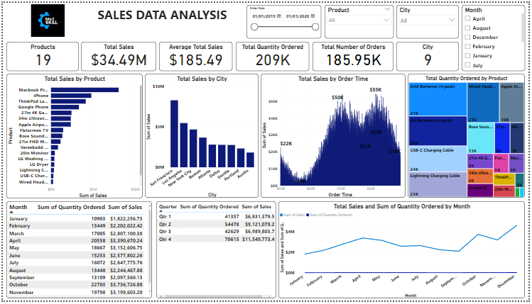

# Sales Data Report

---

# Introduction: 
In this project, I dived into a large sales dataset to extract valuable insights. I explored sales trends over time, identified the best-selling products, calculated revenue metrics such as total sales and profit margins, and created visualizations to present my findings effectively. This project showcases my ability to manipulate and derive insights from large datasets, enabling me to make data-driven recommendations for optimizing sales strategies.

# Problem statement: 
1. What is the total quantity of products sold?
2. What is the total number of orders placed?
3. What is the total quantity sold per product?
4. Identify the best-selling product.
5. Any further pertinent data-driven insights on cardiovascular disease risk prediction report?

# Skills Demonstrated:
1. Quick measures
2. Data cleaning, and 
3. Date transformation

# Data Sourcing: 
The data set was provided by MeriSKILL.

# Data Transformation/Cleaning: 
I cleaned and transformed the data set with the help of Power BI’s power query editor.

# Data Modelling: 
There was no requirement for data modelling because the dataset just contained one sheet or table.

# Analysis and Visualizations: 

---

1. Strong overall sales success is indicated by the examined period's total sales revenue of $34.49M.
Product Insights: Despite only selling 4,728 units, the MacBook Pro Laptop was the most popular item, generating $8,000,000 in total sales income. Following closely after was the iPhone, which brought in over $4,790,000 in sales income, with AAA Batteries (4-pack) bringing in the least ($92,740).
2. The most popular item was AAA Batteries (4-pack), which received the most orders (31,017) but also brought in the least amount of money ($92,740).
3. San Francisco, which contributed $8.26 million to the sales revenue, was the city that generated the most sales revenue. With a total of $1.82 million in sales income, Austin had the lowest production.
4. Monthly revenue and the number of goods ordered grew steadily throughout the year, reaching a high of $4.6M in sales and 28,114 items ordered in December. 
5. Each quarter did well, but the fourth quarter was the strongest with $11.5M in revenue and 70,615 products ordered. While quarter 1 generated the least amount of revenue ($6.8M in total revenue and 41,357 products ordered), quarter 2 also did well, with $9.1M in sales and 54,478 orders.
6. Understanding the seasonal trends in the sales data is essential. Notably, sales volume declined in January while increasing from February through April. But from May through September, sales fell. With a notable uptick of nearly $1,639,166 in income, October stood out with a noticeable jump. Peak sales were recorded in December ($4.6M), which had a major impact on both revenue and quantity ordered. This increase in revenue is most likely the result of people placing special orders and buying gifts over the holiday season.

# Summary:
The analysed time frame demonstrated strong sales performance, with $34.49M in total revenue. Despite having lower unit sales, the MacBook Pro Laptop was the outstanding product, bringing in $8M in revenue. Austin had the lowest revenue contribution at $1.82M, while San Francisco had the highest at $8.26M. The monthly and quarterly statistics showed consistent growth, reaching a peak in December of $4.6M and 70,615 products. Seasonally, sales fell in January, increased through April, fell again until a $1.64 million rise in October, and then reached a high of $4.6 million in December, mostly due to Christmas buying. Strong sales performance overall was seen, despite different product and seasonal characteristics.

# Recommendations:
1. Given that the MacBook Pro Laptop contributed significantly to overall sales income, think about concentrating your marketing efforts on high-margin goods like this one. To fully realise the potential of other well-known items, such as the iPhone, employ marketing methods to boost sales.
2. AAA Batteries (4-pack), although being the most popular item, generated the least amount of money. Analyse this product's pricing strategy and look for ways to boost profitability. To encourage greater purchases, think about grouping AAA Batteries with other well-liked products or providing discounts.
3. A large portion of sales revenue came from San Francisco. Investigate ways to increase your consumer base in this city and adopt effective tactics in other prosperous locations. 
Look at the reasons Austin had the lowest sales revenue. To find possible development areas or marketing improvements, it might be worthwhile to examine the neighbourhood market.
4. Be aware of how the seasons affect sales trends. Marketing activities and inventory levels should be adjusted accordingly. By stocking up on popular items and conducting holiday-themed promotions, you may prepare for increased sales throughout the holiday season.
5. Throughout the year, take advantage of the monthly trend of rising revenue and order volume. To follow these trends, strategically plan your product launches, promotions, and discounts.
6. Recognise the robust results from the fourth quarter and direct resources and marketing efforts in this time period accordingly. Despite the fact that the first quarter had the lowest revenue, consider strategies to enhance performance. For example, consider introducing new goods or running discounts to increase sales.

---
